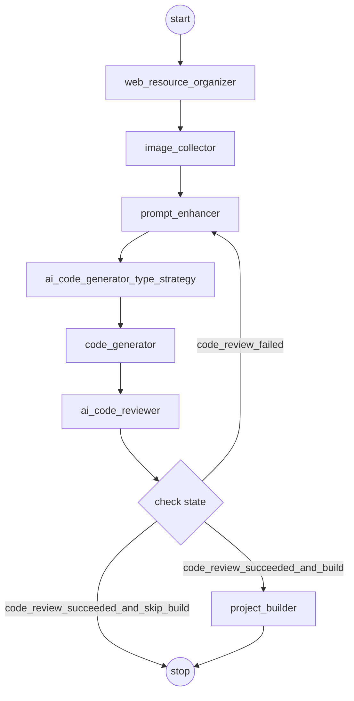

# RichCodeWeaver 代码生成工作流深度分析报告

> 分析日期：2026-03-27  
> 分析范围：server.log、AI Prompts、RAG Docs、工作流源码  
> 分析目标：梳理系统架构、定位性能瓶颈、提出优化建议

---

## 一、系统架构概览

### 1.1 微服务模块

| 模块 | 职责 |
|------|------|
| `rich-code-weaver-generator` | 核心代码生成服务（工作流编排、节点执行） |
| `rich-code-weaver-ai` | AI 能力层（模型配置、工具定义、RAG） |
| `rich-code-weaver-prompt` | 系统提示词管理（Dubbo 远程服务） |
| `rich-code-weaver-file` | 文件/OSS 服务（Dubbo 远程服务） |
| `rich-code-weaver-user` | 用户服务 |
| `rich-code-weaver-web` | 前端 Vue 应用 |
| `rich-code-weaver-social` | 社交模块（点赞/收藏/评论） |
| `rich-code-weaver-model` | 数据模型层 |
| `rich-code-weaver-common` | 公共工具类 |
| `rich-code-weaver-client` | Dubbo 内部服务接口定义 |
| `rich-code-weaver-server-admin` | Spring Boot Admin 监控 |

### 1.2 AI 模型配置

| 用途 | 模型 | Bean 名称 | 调用方式 | max_tokens |
|------|------|-----------|----------|------------|
| 基础服务（审查/策略/资源/图片） | `qwen-plus` | `CommonChatModelConfig` 多例 | 非流式 | 8192 |
| 代码生成（HTML/MULTI_FILE） | `qwen3-coder-plus` | `streamingChatModel` | 流式 | 32768 |
| 代码生成（VUE_PROJECT） | `qwen3-coder-plus` | `reasoningStreamingChatModel` | 流式+工具 | 32768 |
| Embedding | `text-embedding-v4` | RAG 专用 | 批量 | - |

所有模型通过 DashScope 兼容 OpenAI 接口调用：`https://dashscope.aliyuncs.com/compatible-mode/v1`

### 1.3 AI 工具清单

| 工具名 | 类 | 用途 | 可用节点 |
|--------|-----|------|----------|
| `searchWeb` | `AiWebSearchTool` | 百度千帆搜索 API | web_resource_organizer |
| `scrapeWebPage` | `AiWebScrapingTool` | Jsoup 网页抓取（截取前400字符） | web_resource_organizer |
| `searchImages` | `ImageSearchTool` | 接口盒子百度图片搜索 API | image_collector |
| `aiGeneratorImage` | `AiGeneratorImageTool` | DashScope wan2.2-t2i-flash 文生图 | image_collector |
| `creatAndWrite` | - | 创建并写入文件 | code_generator (VUE) |
| `modifyFile` | - | 修改文件内容 | code_generator (VUE) |
| `deleteFile` | - | 删除文件 | code_generator (VUE) |
| `readDir` | - | 读取目录结构 | code_generator (VUE) |
| `readFile` | - | 读取文件内容 | code_generator (VUE) |

---

## 二、工作流架构详解

### 2.1 工作流图（Mermaid）



### 2.2 节点详细说明

#### 节点 1：`web_resource_organizer` — 网络资源整理

- **实现类**：`WebResourceOrganizeNode` → `AiWebResourceOrganizeService`
- **工厂**：`AiWebResourceOrganizeServiceFactory`
- **模型**：`qwen-plus`（非流式 + 工具调用）
- **可用工具**：`searchWeb`、`scrapeWebPage`
- **系统提示词**：`web-resource-organize-system-prompt`（存储在数据库，通过 Dubbo 远程获取）
- **输入**：用户原始提示词
- **输出**：`context.webResourceListStr`（网络资源文本）
- **异常处理**：失败时设置 `errorMessage`，不中断工作流

#### 节点 2：`image_collector` — 图片资源收集

- **实现类**：`ImageResourceNode` → `AiImageResourceService`
- **工厂**：`AiImageResourceServiceFactory`
- **模型**：`qwen-plus`（非流式 + 工具调用）
- **可用工具**：`searchImages`、`aiGeneratorImage`
- **系统提示词**：`image-resource-system-prompt`（存储在数据库）
- **输入**：用户原始提示词
- **输出**：`context.imageListStr`（图片 URL 列表文本）
- **特殊流程**：AI 图片生成为异步任务，需轮询等待（最多 60 秒，每 5 秒一次），生成后下载→上传 OSS→返回 OSS URL

#### 节点 3：`prompt_enhancer` — 提示词增强

- **实现类**：`PromptEnhancerNode`（纯逻辑，无 AI 调用）
- **三种模式**：
  1. **首次生成**：将图片素材 + 网络资源 + 强制使用指令 + 用户原始需求组合为增强提示词
  2. **代码审查失败修复**：构建错误修复提示词（含错误列表 + 修复建议 + 修复要求）
  3. **二次修改**：构建修改提示词（HTML/MULTI_FILE 附加现有代码；VUE_PROJECT 指引使用工具）
- **输入**：`context.originalPrompt` + `context.webResourceListStr` + `context.imageListStr`
- **输出**：`context.enhancedPrompt`
- **关键设计**：素材区域放在用户需求之前，确保 AI 优先看到并使用

#### 节点 4：`ai_code_generator_type_strategy` — 代码类型策略

- **实现类**：`AiCodeGeneratorTypeStrategyNode` → `AiCodeGeneratorTypeStrategyService`
- **模型**：`qwen-plus`（非流式）
- **系统提示词**：`code-generation-strategy-system-prompt.txt`
- **判断逻辑**：
  1. 若用户选择了 `AI_STRATEGY`：将增强后提示词发送给 AI 判断类型
  2. 若用户指定了固定类型：检查提示词是否包含不同类型关键词（正则匹配），若有则覆盖
  3. AI 判断失败时默认回退到 `HTML` 类型
- **输出**：更新 `context.generationType` 并写入数据库 `app.codeGenType`

#### 节点 5：`code_generator` — AI 代码生成

- **实现类**：`CodeGeneratorNode` → `AIGenerateCodeAndSaveToFileUtils`
- **服务工厂**：`AiCodeGeneratorServiceFactory`（Caffeine 缓存实例，30 分钟写入过期/10 分钟访问过期）
- **模型选择**：
  - HTML/MULTI_FILE → `qwen3-coder-plus`（流式，无工具）
  - VUE_PROJECT → `qwen3-coder-plus`（流式 + 文件操作工具，最大 25 次连续工具调用）
- **对话记忆**：Redis ChatMemoryStore，滑动窗口 50 条，从数据库加载最近 10 条历史
- **RAG 增强**：若 `rag.enabled=true`，注入 RetrievalAugmentor（PGVector 按 codeGenType 过滤，minScore=0.6，maxResults=5）
- **流式转发**：通过 `ConcurrentHashMap<Long, Consumer<String>>` 注册发射器，实时转发到 SSE
- **VUE 模式特殊处理**：通过 `JsonStreamHandler` 解析 JSON 流中的工具调用
- **超时**：`blockLast(Duration.ofMinutes(10))`

#### 节点 6：`ai_code_reviewer` — 代码审查

- **实现类**：`AICodeReviewNode` → `AiCodeReviewService`
- **模型**：`qwen-plus`（非流式）
- **系统提示词**：`code-review-system-prompt.txt`
- **审查流程**：
  1. **结构性预检查**（磁盘文件级别）：
     - HTML：至少一个 .html 文件
     - MULTI_FILE：index.html + style.css + script.js
     - VUE_PROJECT：index.html、package.json、vite.config.js、src/main.js、检查本地资源引用
  2. **AI 代码审查**：拼接所有代码文件内容，发送给 AI 分析
- **异常处理**：审查异常时 `isPass=true`（跳过审查继续执行）
- **reviewCount**：每次审查递增，用于路由判断

#### 节点 7：`project_builder` — 项目构建（条件执行）

- **实现类**：`ProjectBuilderNode` → `BuildWebProjectExecutor`
- **触发条件**：仅 VUE_PROJECT 类型且代码审查通过
- **执行**：`npm install` + `npm run build`
- **输出**：`context.deployDir = outputDir + "/dist"`
- **异常处理**：构建失败时回退到源码目录

### 2.3 条件路由逻辑

```java
// CodeGenWorkflowApp.nodeRouter()
MAX_CODE_REVIEW_ATTEMPTS = 2;

if (codeReviewResponse == null) → "code_review_failed"
if (!isPass && reviewCount < 2) → "code_review_failed"  // 回到 prompt_enhancer 重试
if (HTML || MULTI_FILE)         → "code_review_succeeded_and_skip_build"
if (VUE_PROJECT)                → "code_review_succeeded_and_build"
```

### 2.4 二次修改工作流（简化）

```
START → prompt_enhancer → code_generator → ai_code_reviewer → [条件路由] → END
```

跳过 `web_resource_organizer`、`image_collector`、`ai_code_generator_type_strategy`。

### 2.5 SSE 流式输出架构

```
CodeGenWorkflowApp (虚拟线程)
  ├── emitStreamText() — 工作流状态信息，逐字符发送（15ms/字符）
  ├── CodeGeneratorNode — AI 代码流式输出（实时转发）
  └── CommonStreamHandler — 统一封装为 SSE JSON 格式 {"b": "内容"}
        ├── doOnError → 保存错误到对话历史
        ├── onErrorResume → 处理连接中断
        ├── concatWith → 追加 "end" 事件
        └── doFinally → 保存 AI 响应到对话历史（chat_history 表）
```

**独立订阅设计**：AI 生成与客户端连接解耦，所有事件缓存到 `StreamSessionService`，支持断线重连。

---

## 三、运行时性能分析

### 3.1 完整工作流时序（基于 server.log 实测数据）

> 测试场景：用户请求 "创建工作汇报网页"，AI 策略选择 → single_html

| # | 节点 | 开始时间 | 结束时间 | 耗时 | AI 调用次数 | 备注 |
|---|------|----------|----------|------|-------------|------|
| 1 | web_resource_organizer | 13:01:45 | 13:02:53 | **~68s** | 2次 LLM + 1次搜索 + 1次抓取 | **最大瓶颈** |
| 2 | image_collector | 13:02:56 | 13:03:16 | **~19s** | 1次 LLM + 1次图片搜索 + 1次图片生成 + OSS上传 | 含异步轮询 |
| 3 | prompt_enhancer | ~13:03:20 | ~13:03:28 | **~8s** | 0次（纯逻辑） | 主要耗时在 emitStreamText |
| 4 | type_strategy | 13:03:24 | 13:03:25 | **~1s** | 1次 LLM（796ms） | 最快节点 |
| 5 | code_generator | 13:03:28 | 13:04:23 | **~55s** | 1次流式 LLM + 1次 Embedding | 含 RAG 检索 |
| 6 | ai_code_reviewer | 13:04:28 | 13:04:36 | **~8s** | 1次 LLM（7579ms） | 审查通过 |
| - | 工作流状态推送 | - | 13:04:54 | ~18s | 0 | emitStreamText 累计 |
| | **总计** | 13:01:36 | 13:04:54 | **~198s（3分18秒）** | **6次 LLM + 1次 Embedding** | |

### 3.2 LLM 调用明细

| 调用点 | 模型 | 流式 | prompt_tokens | completion_tokens | API 耗时 |
|--------|------|------|---------------|-------------------|----------|
| 网络资源整理（第1轮） | qwen-plus | 否 | ~2000 | ~500 | ~5s |
| 网络资源整理（第2轮+工具） | qwen-plus | 否 | ~4000 | ~10000 | ~55s |
| 图片收集 | qwen-plus | 否 | ~2000 | ~300 | ~3s |
| 代码类型策略 | qwen-plus | 否 | 4547 | 1 | 796ms |
| 代码生成 | qwen3-coder-plus | **是** | ~10000 | ~17000 | ~53s |
| 代码审查 | qwen-plus | 否 | 5239 | 320 | 7579ms |

### 3.3 耗时分布饼图（估算）

```
网络资源整理    ████████████████████████████████████  34%  (68s)
代码生成        ████████████████████████████          28%  (55s)
图片收集        ██████████                            10%  (19s)
流式推送延迟    █████████                              9%  (18s)
代码审查        ████                                   4%  (8s)
提示词增强      ████                                   4%  (8s)
类型策略        █                                      1%  (1s)
其他开销        █████████                             10%  (19s)
```

---

## 四、发现的问题

### 4.1 【严重】网络资源整理节点产出了完整 HTML 代码

**现象**：`web_resource_organizer` 节点输出了 10245 字符的内容，其中包含一份完整的 HTML 网页代码（含 CSS 样式和完整的业务内容），而非预期的"网络资源素材"。

**影响**：
1. 这份 HTML 代码被 `prompt_enhancer` 作为"参考内容"注入到代码生成 prompt 中
2. 代码生成节点几乎原样复制了这段代码，仅做微小改进（添加 Font Awesome、BEM 命名、banner 图片）
3. 浪费了约 10000 个 prompt tokens 和 68 秒执行时间
4. 代码生成的"创造性"被大幅削弱，几乎变成了"复制粘贴"

**根因**：`web-resource-organize-system-prompt` 系统提示词（存储在数据库中）缺少"禁止生成代码"的约束，导致 AI 在搜索到相关内容后自行生成了完整代码。

**建议**：在 `web-resource-organize-system-prompt` 中明确添加约束：
```
## 严禁事项
- 禁止生成任何代码（HTML/CSS/JavaScript/Vue 等）
- 禁止生成完整的网页模板或代码片段
- 你的职责仅是搜索和整理文本素材、数据、链接
- 输出必须是纯文本形式的素材整理结果
```

### 4.2 【严重】web_resource_organizer 和 image_collector 串行执行但无依赖

**现象**：两个资源收集节点严格串行：`web_resource_organizer`（68s）→ `image_collector`（19s），总计 87 秒。

**分析**：
- `image_collector` 仅依赖 `context.originalPrompt`，不依赖 `context.webResourceListStr`
- 两者完全可以并行执行，理论节省 19 秒（取较长者 68 秒）
- LangGraph4j 目前不原生支持并行节点，但可通过 `CompletableFuture` 在单个节点内实现

**建议**：创建一个 `ResourceCollectorNode` 合并节点，内部使用 `CompletableFuture.allOf()` 并行执行两个服务调用。

### 4.3 【中等】emitStreamText 逐字符发送导致无意义延迟

**现象**：`CodeGenWorkflowApp.emitStreamText()` 对所有工作流状态文本逐字符发送，每字符 sleep 15ms。

**计算**：工作流状态信息（markdown 报告）约 1200 个字符，累计 sleep 约 18 秒。

**影响**：用户感知的总耗时增加 18 秒，但这些文本不是 AI 生成的代码，不需要模拟打字效果。

**建议**：对工作流状态信息改用批量发送（按段落或一次性），仅对 AI 代码生成流保留逐字效果。

### 4.4 【中等】代码审查放过了运行时 Bug

**现象**：审查结果 `isPass=true`，但 `suggestionList` 中报告了一个实际的运行时错误：

```
document.getElementById('current-date') 引用了不存在的 DOM 元素
→ TypeError: Cannot set property 'textContent' of null
```

**影响**：生成的网页在浏览器中会抛出 JS 错误，可能导致后续脚本中断。

**建议**：在 `code-review-system-prompt.txt` 中将 "JS 引用不存在的 DOM 元素" 提升为严重问题（应标记为不通过），而非建议。

### 4.5 【中等】scrapeWebPage 仅截取前 400 字符

**现象**：`AiWebScrapingTool.scrapeWebPage()` 对抓取的网页仅返回 HTML 前 400 字符。

**影响**：400 字符通常只包含 `<head>` 标签内容（meta、title、CSS 引用），实际正文内容几乎无法获取，工具效用大打折扣。

**建议**：
1. 使用 Jsoup 的 `.text()` 提取纯文本而非 `.html()` 获取原始 HTML
2. 将截取长度提升到 2000-4000 字符
3. 或仅提取 `<body>` 内的文本内容

### 4.6 【低等】Caffeine 缓存的 AI 服务实例首次创建时加载历史失败

**现象**：日志显示 `为 appId: 395002924146741248 加载历史记录失败`，原因是 chat_history 表中此时仅有 user 消息（AI 响应尚未生成），查询偏移量为 1 导致返回空。

**分析**：SQL 查询使用 `LIMIT 1, 10`（跳过第 1 条），但首次生成时只有 1 条用户消息，跳过后为空。这不影响功能（添加了提示消息兜底），但导致了一个 WARN 级别的日志噪音。

### 4.7 【低等】基础设施告警

1. **Spring Boot Admin**：持续 WARN 无法连接 `http://localhost:9001/instances`（Admin Server 未启动）
2. **Dubbo 服务**：`InnerScreenshotService` 和 `InnerFileService` 收到空 URL 地址列表
3. **Nacos 心跳**：正常，无异常

---

## 五、RAG 知识库分析

### 5.1 文档映射

| 文档文件 | codeGenType | 核心约束 |
|----------|-------------|----------|
| `rag-web-dev-guide-html.md` (209行) | HTML | 单文件、无工具、CDN 引入、localStorage |
| `rag-web-dev-guide-multi-file.md` (217行) | MULTI_FILE | 三文件分离、无工具、跨文件协调 |
| `rag-web-dev-guide-vue-project.md` (217行) | VUE_PROJECT | Vue3+Vite、有工具调用、hash 路由 |

### 5.2 检索配置

- **存储**：PGVector（PostgreSQL 扩展），表名 `rag_embeddings`，维度 1536
- **Embedding 模型**：DashScope `text-embedding-v4`
- **检索参数**：`minScore=0.6`，`maxResults=5`
- **过滤**：`codeGenType == currentType OR codeGenType == GENERAL`
- **注入模板**：权威参考形式，强调"必须严格遵循、不可违反或忽略"
- **文档分块**：递归分割，500 字符 / 50 字符重叠
- **自动摄入**：启动时检查存储是否为空，为空则自动加载 `docs/ragDocs/*.md`

### 5.3 RAG 与 System Prompt 的关系

系统存在两层知识注入：
1. **System Prompt**（`docs/aiPrompts/*.txt` → 数据库）：作为系统消息注入，定义 AI 角色和行为规范
2. **RAG**（`docs/ragDocs/*.md` → PGVector）：作为用户消息上下文注入，提供具体开发规范参考

两者内容有大量重叠（如技术栈约束、输出格式要求），但 RAG 文档更侧重"能力边界"和"功能限制"的详细描述。

---

## 六、AI Prompt 体系分析

### 6.1 Prompt 清单

| Prompt Key | 文件 | 用途 | Token 估算 |
|------------|------|------|------------|
| `prompt-optimization-system-prompt` | 同名 .txt | 提示词优化助手 | ~500 |
| `code-generation-strategy-system-prompt` | 同名 .txt | 代码类型选择器 | ~800 |
| `html-system-prompt` | 同名 .txt | 单 HTML 代码生成 | ~2000 |
| `multi-file-system-prompt` | 同名 .txt | 三文件代码生成 | ~2500 |
| `vue-project-system-prompt` | 同名 .txt | Vue 项目代码生成 | ~3500 |
| `code-review-system-prompt` | 同名 .txt | 代码审查 | ~1200 |
| `web-resource-organize-system-prompt` | 数据库存储 | 网络资源整理 | 未知 |
| `image-resource-system-prompt` | 数据库存储 | 图片资源收集 | 未知 |

### 6.2 Prompt 设计模式

- **角色定义**：每个 prompt 开头明确 AI 角色（"你是一位资深 Web 前端开发专家"）
- **核心约束**：强调无后端、纯静态、无构建工具（HTML/MULTI_FILE）
- **分级规则**：代码审查使用三级分类（致命→严重→非阻塞）
- **输出格式**：严格定义代码块格式（```html / ```css / ```javascript），便于正则提取
- **修改模式**：区分首次生成和二次修改，修改模式强调"局部修改，不重新生成"

---

## 七、优化建议（按优先级排序）

### P0 — 高优先级（预计提升 30-40% 整体耗时）

#### 7.1 约束网络资源整理节点禁止生成代码

- **改动点**：更新数据库中 `web-resource-organize-system-prompt` 的内容
- **预期效果**：减少无效 token 消耗，输出从 10245 字符降至 ~2000 字符，节省 ~30s
- **风险**：低

#### 7.2 并行化 web_resource_organizer 和 image_collector

- **改动点**：新建 `ResourceCollectorNode`，内部用 `CompletableFuture.allOf()` 并行执行
- **预期效果**：节省 ~19 秒（取较长者而非累加）
- **风险**：中（需要处理异常合并和上下文同步）
- **代码示意**：
```java
CompletableFuture<String> webFuture = CompletableFuture.supplyAsync(
    () -> aiWebResourceOrganizeService.webResource(prompt));
CompletableFuture<String> imageFuture = CompletableFuture.supplyAsync(
    () -> aiImageResourceService.resourceImages(prompt));
CompletableFuture.allOf(webFuture, imageFuture).join();
context.setWebResourceListStr(webFuture.get());
context.setImageListStr(imageFuture.get());
```

#### 7.3 emitStreamText 对状态文本改用批量发送

- **改动点**：`CodeGenWorkflowApp.emitStreamText()` 新增 `emitStreamBlock()` 方法一次性发送
- **预期效果**：节省 ~18 秒
- **风险**：低（前端已支持批量接收）
- **代码示意**：
```java
private void emitStreamBlock(FluxSink<String> sink, StringBuilder builder, String text) {
    sink.next(text);
    builder.append(text);
}
```

### P1 — 中优先级

#### 7.4 提升 scrapeWebPage 截取长度并改用纯文本

- **改动点**：`AiWebScrapingTool.scrapeWebPage()` 使用 `.text()` 替代 `.html()`，提升到 2000 字符
- **预期效果**：提高网络资源质量，间接提升代码生成质量
- **风险**：低

#### 7.5 加强代码审查对 JS 运行时错误的检测

- **改动点**：更新 `code-review-system-prompt.txt`，增加 "JS 引用不存在的 DOM 元素应标记为严重错误"
- **预期效果**：减少生成代码的运行时 Bug
- **风险**：低，但可能增加审查失败导致重试的概率

#### 7.6 对简单需求支持跳过网络搜索

- **改动点**：在 `WebResourceOrganizeNode` 增加智能判断，若用户已提供充分详细内容则跳过
- **预期效果**：对内容详尽的需求节省 68 秒
- **风险**：中（判断标准需要仔细设计）

### P2 — 低优先级

#### 7.7 修复首次创建时对话历史加载逻辑

- **改动点**：`ChatHistoryServiceImpl.loadChatHistoryToMemory()` 偏移量从 1 改为 0，或检查消息数量
- **预期效果**：消除 WARN 级别日志噪音
- **风险**：极低

#### 7.8 禁用或配置 Spring Boot Admin 客户端

- **改动点**：`application.yml` 中禁用 Admin 客户端或配置正确的 Admin Server 地址
- **预期效果**：消除无效注册重试日志
- **风险**：极低

#### 7.9 检查 Dubbo 服务注册

- **改动点**：确认 `InnerScreenshotService` / `InnerFileService` provider 是否已部署
- **预期效果**：消除空地址列表告警
- **风险**：极低

---

## 八、理想目标耗时估算

实施 P0 优化后的预期耗时：

| 节点 | 当前耗时 | 优化后预计 | 节省 |
|------|----------|------------|------|
| 资源收集（并行后） | 87s | 40s | **47s** |
| 提示词增强 | 8s | 1s | **7s** |
| 类型策略 | 1s | 1s | 0 |
| 代码生成 | 55s | 45s | **10s**（prompt tokens 减少） |
| 代码审查 | 8s | 8s | 0 |
| 流式推送 | 18s | 1s | **17s** |
| **总计** | **198s** | **~117s** | **~81s（节省 41%）** |

---

## 九、附录

### A. 关键文件路径

```
rich-code-weaver-generator/
  src/main/java/com/rich/app/
    langGraph/
      CodeGenWorkflowApp.java          # 工作流主类
      state/WorkflowContext.java        # 工作流上下文
      node/
        WebResourceOrganizeNode.java    # 网络资源整理节点
        ImageResourceNode.java          # 图片收集节点
        PromptEnhancerNode.java         # 提示词增强节点
        AiCodeGeneratorTypeStrategyNode.java  # 类型策略节点
        CodeGeneratorNode.java          # 代码生成节点
        AICodeReviewNode.java           # 代码审查节点
        ProjectBuilderNode.java         # 项目构建节点
    factory/
      AiCodeGeneratorServiceFactory.java     # 代码生成服务工厂
      AiWebResourceOrganizeServiceFactory.java  # 网络资源服务工厂
      AiImageResourceServiceFactory.java     # 图片资源服务工厂
    utils/
      streamHandle/CommonStreamHandler.java  # SSE 流处理器
      
rich-code-weaver-ai/
  src/main/java/com/rich/ai/
    config/CommonChatModelConfig.java    # 通用模型配置
    service/
      AiWebResourceOrganizeService.java  # 网络资源整理接口
      AiImageResourceService.java        # 图片资源收集接口
      AiCodeGeneratorService.java        # 代码生成接口
      AiCodeReviewService.java           # 代码审查接口
    aiTools/
      BaseTool.java                      # 工具基类
      webOperate/
        AiWebSearchTool.java             # 百度千帆搜索
        AiWebScrapingTool.java           # Jsoup 网页抓取
      ImageResource/
        ImageSearchTool.java             # 接口盒子图片搜索
        AiGeneratorImageTool.java        # DashScope 文生图
    rag/
      RagConfig.java                     # RAG 配置
      RagDocumentIngestService.java      # 文档摄入
      RagContentRetrieverAugmentorFactory.java  # 检索增强工厂

docs/
  aiPrompts/                             # 系统提示词文件
  ragDocs/                               # RAG 知识库文档
```

### B. 外部 API 依赖

| API | 提供方 | 用途 |
|-----|--------|------|
| DashScope Chat API | 阿里云百炼 | LLM 对话/代码生成 |
| DashScope Text2Image API | 阿里云百炼 (wan2.2-t2i-flash) | AI 图片生成 |
| DashScope Embedding API | 阿里云百炼 (text-embedding-v4) | RAG 向量化 |
| 百度千帆搜索 API | 百度 | 联网搜索 |
| 接口盒子图片搜索 API | apihz.cn | 百度图片搜索 |
| 阿里云 OSS | 阿里云 | AI 生成图片存储 |
